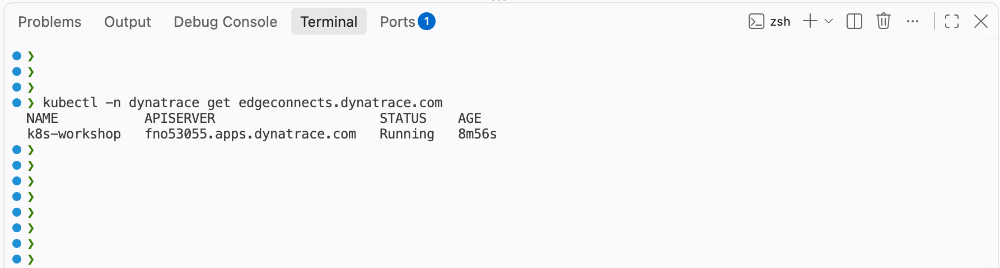
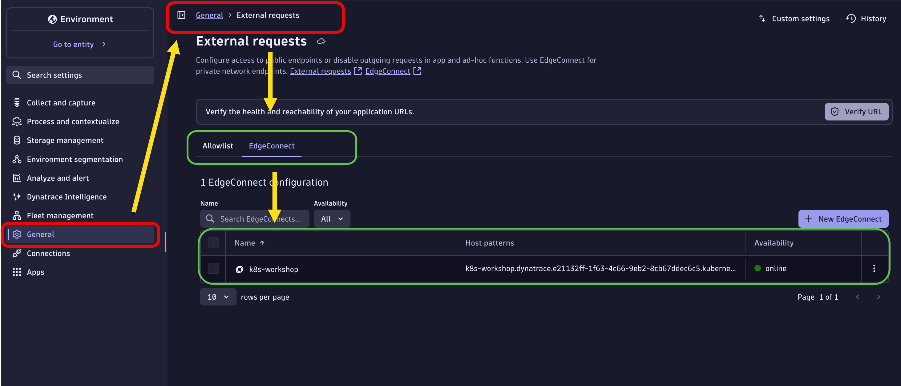
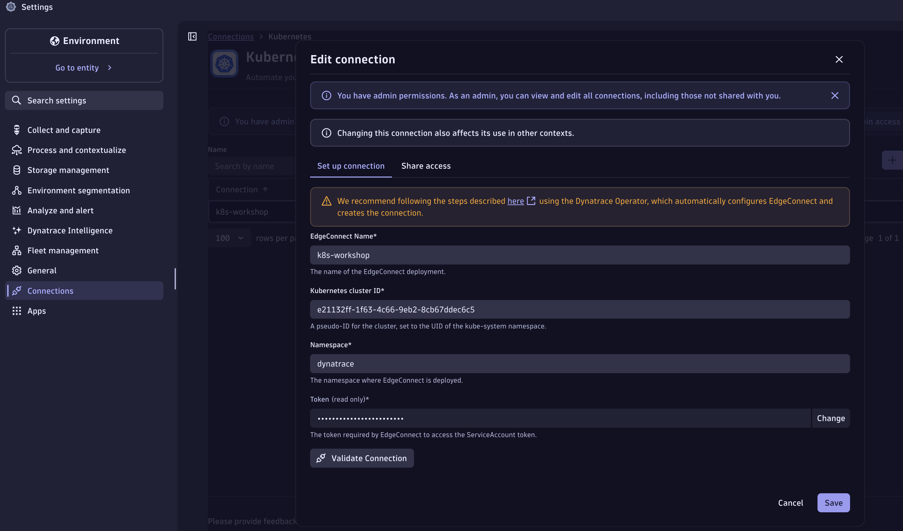

--8<-- "snippets/dt-enablement.md"

# Deployment

This section covers deploying EdgeConnect (RBAC + CRD) and verifying that it is connected to Dynatrace. Everything specific to a scenario lives in [Use Cases](edgeconnect-usecases.md).

---

## Part 3 — Deploy EdgeConnect (RBAC + CRD)

The `deployEdgeConnect` function reads your credentials directly from environment variables set as Codespace secrets (`DT_CLIENT_ID`, `DT_CLIENT_SECRET`, `DT_ENVIRONMENT`, `DT_URN_ACCOUNT`), substitutes them into the manifest in memory, and applies everything in one step — no manual file editing required.

### Step 3.1 — Deploy EdgeConnect

```bash
deployEdgeConnect
```

!!! info "What this function does"
    1. Validates that all four required environment variables are set
    2. Strips any `https://` prefix from `DT_ENVIRONMENT` (the `apiServer` field requires hostname only)
    3. Substitutes credentials into the manifest in-memory via `sed` — nothing is written to disk
    4. Applies the manifest via `kubectl apply`, creating:
        - `ServiceAccount` (`edgeconnect-sa`) in the `dynatrace` namespace
        - `Role` (`edgeconnect-role`) with least-privilege pod/deployment/configmap/job/PVC access
        - `RoleBinding` (`edgeconnect-rb`) binding the role to the service account
        - `Secret` containing your OAuth credentials
        - `EdgeConnect` CRD resource enabling `kubernetesAutomation`
    5. Prints the EdgeConnect resource and pod status immediately after apply

### Step 3.2 — Verify EdgeConnect is running

```bash
kubectl get edgeconnect -n dynatrace
kubectl get pods -n dynatrace | grep edgeconnect
```

!!! tip ""
    The EdgeConnect pod should reach `Running` state within ~60 seconds. It registers itself in the Dynatrace UI automatically.

!!! example ""
    

### Step 3.3 — Confirm registration in Dynatrace

!!! example "Step-by-step"

    1. Open your Dynatrace environment
    2. Navigate to **Settings > General > External Request > EdgeConnect**
    3. You should see `k8s-workshop` listed with status **Online**

!!! example ""
    

!!! example "Step-by-step (continued)"

    4. Navigate to **Settings > Connections > Kubernetes > k8s-workshop**
    5. Validate that `k8s-workshop` shows status **Connected**

!!! example ""
    

---

!!! tip "EdgeConnect is ready"
    The simulation workloads, workflow imports, and workflow configuration are part of each use case, so you can run them independently.

<div class="grid cards" markdown>
- [Continue to Use Cases :octicons-arrow-right-24:](edgeconnect-usecases.md)
</div>
