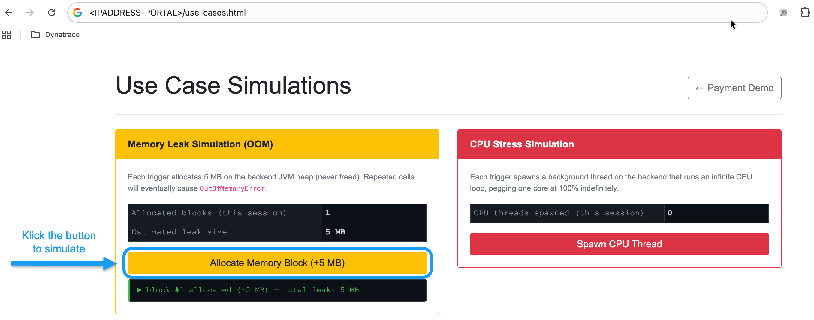

--8<-- "snippets/dt-enablement.md"

# Use Case 2: Out of Memory Pod

The `dtpay` application is pushed past its memory limit and crashes. Davis AI detects it and the workflow asks for approval before restarting the deployment.

### Step 2.1 — Deploy the simulation

```bash
deployDtpay
```

!!! info ""
    This deploys the `dtpay` application in the `dtpay` namespace. The container is configured with:

    - Memory limit: `512Mi`
    - JVM flag: `-XX:+ExitOnOutOfMemoryError`
    - A `/usecase.html` load endpoint that allocates memory until the pod crashes

Verify it is running:

```bash
kubectl get all -n dtpay
```

### Step 2.2 — Import the workflow

!!! example "Step-by-step"

    1. In the Dynatrace UI, navigate to **Automations > Workflows**
    2. Click **Import workflow** (top-right corner)
    3. Download and import the workflow: [automate restart pods](workflow/use-case-automation-oom-remediation-w-k8s.workflow.json){:download}

### Step 2.3 — Configure the workflow

Open **`[use case automation] oom remediation w k8s`**:

!!! example "Step-by-step"

    1. Click the **`send_notification`** task → update the Slack connection and channel to your own
    2. Click the **`request_approval`** task → update the approver email/user ID
    3. Click the **`restart_deployment`** task → confirm the EdgeConnect instance is set to `k8s-workshop`
    4. Save and **Activate** the workflow

### Step 2.4 — Trigger the OOM

!!! example "Step-by-step"

    1. In VS Code, open **Ports** → find the `dtpay` frontend port
    2. Open the exposed URL in a browser:

    ```
    https://<EXTERNAL-IP>/usecase.html
    ```

!!! example ""
    

!!! example "Step-by-step (continued)"

    3. Click the trigger button on the page to start the memory allocation loop
    4. Watch the pod crash in the terminal:

    ```bash
    kubectl -n dtpay get pods -w
    ```

### Step 2.5 — Validate the approval-gated workflow

!!! success "Expected flow"
    1. Davis AI detects **Memory resources exhausted**
    2. The `OOM Remediation` workflow fires:
        - :material-slack: **Slack notification** is sent to your configured channel
        - :material-email: **Approval email** is sent to the configured approver
    3. Open the approval link in the email
    4. Click **Approve**
    5. The workflow executes:
        ```bash
        kubectl rollout restart deployment/dtdemo-usecase -n dtpay
        ```
    6. A follow-up :material-slack: **Slack confirmation** is sent

- Navigate to **Automations > Workflows** → check execution history and individual task states
- Navigate to **Infrastructure > Kubernetes** → verify the deployment restarted successfully

<div class="grid cards" markdown>
- [Continue to Cleanup :octicons-arrow-right-24:](cleanup.md)
</div>
