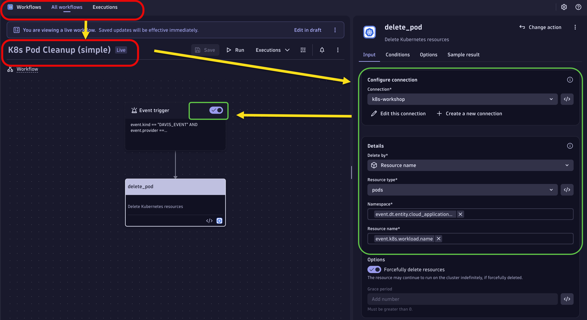
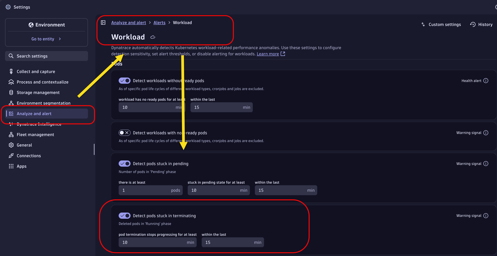
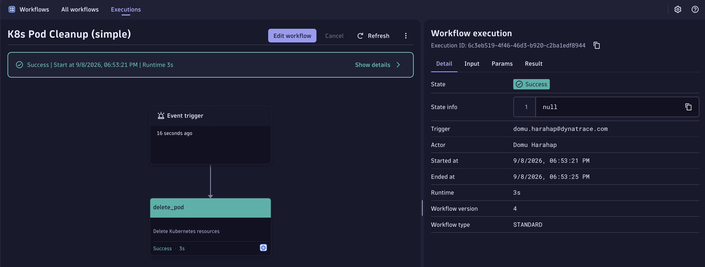

--8<-- "snippets/dt-enablement.md"

# Use Cases

With EdgeConnect deployed, run the two automation scenarios below. Each use case is self-contained and follows the same five steps:

1. **Deploy** the simulation workload
2. **Import** the workflow
3. **Configure** the workflow
4. **Trigger** the problem
5. **Validate** the remediation

| # | Use Case | Trigger | Remediation | Mode |
|---|---|---|---|---|
| 1 | [Pod Stack (Stuck Terminating Pod)](#use-case-1-pod-stack) | Pod stuck in `Terminating` > 5 min | Force-delete the pod | Zero-touch |
| 2 | [Out of Memory Pod](edgeconnect-usecase-oom.md) | App hits memory limit and crashes | `kubectl rollout restart` | Approval-gated |

---

## Use Case 1: Pod Stack

A pod gets stuck in `Terminating` state. Davis AI detects it and the workflow force-deletes the pod automatically — no approval required.

### Step 1.1 — Deploy the simulation

```bash
cd .devcontainer/apps
kubectl create ns dtusecase
kubectl -n dtusecase apply -f podtermination/podtermination-usecase.yaml
```

!!! info ""
    This creates a `busybox` pod named `stuck-pod` with a `preStop` hook that sleeps 300 seconds, simulating a pod stuck in `Terminating` state.

Verify it is running:

```bash
kubectl -n dtusecase get pod stuck-pod
```

### Step 1.2 — Import the workflow

!!! example "Step-by-step"

    1. In the Dynatrace UI, navigate to **Automations > Workflows**
    2. Click **Import workflow** (top-right corner)
    3. Download and import the workflow: [pod stack cleanup](workflow/use-case-automation-k8s-pod-cleanup.workflow.json){:pods-stuck-cleanup}
    4. Change the K8s connections and Save Deploy the workflow

    The JSON files are also available in the [reference repository](https://github.com/domuharahap/Dynatrace-EdgeConnect).

### Step 1.3 — Configure the workflow

Open **`[use-case automation] - K8s Pod Cleanup`**:

!!! example "Step-by-step"

    1. Click the **`delete_pod`** task
    2. Confirm the EdgeConnect instance is set to `k8s-workshop`
    3. Save and **Activate** the workflow

!!! example ""
    

### Step 1.4 — Configure anomaly detection

!!! warning "Demo preparation"
    Before triggering the scenario, change the Kubernetes anomaly detection sensitivity so the workflow fires quickly during the demo. By default, Dynatrace waits 10 minutes before raising a problem, but the `stuck-pod` only hangs for 5 minutes, so the problem would never open.

!!! example "Step-by-step"

    1. In Dynatrace, open **Settings**
    2. Navigate to **Analyze and alert > Alerts > Workload**
    3. Under **Pods**, find **Detect pods stuck in terminating** and make sure the toggle is **on**
    4. Lower the thresholds, for example:
        - **pod termination stops progressing for at least:** `2` min (default `10`)
        - **within the last:** `5` min (default `15`)
    5. Click **Save changes**

!!! tip "Navigation shortcut"
    Use **Search settings** in the left menu and type `Workload` to jump straight to the page.

!!! example ""
    

### Step 1.5 — Trigger the stuck pod

Delete the pod — it will enter `Terminating` state and hang for 5 minutes due to its `preStop` hook:

```bash
kubectl delete pod stuck-pod -n dtusecase
kubectl -n dtusecase get pod stuck-pod -w
```

### Step 1.6 — Validate the zero-touch workflow

!!! success "Expected flow"
    1. Davis AI detects **Pods stuck in terminating**
    2. The `K8s Pod Cleanup` workflow fires **automatically** — no approval required
    3. The `delete_pod` task force-deletes the stuck pod via the EdgeConnect K8s connector
    4. Davis AI closes the problem

- Navigate to **Automations > Workflows** → check the `K8s Pod Cleanup` execution history
- Confirm the pod is gone:

```bash
kubectl -n dtusecase get pod stuck-pod
```

!!! example ""
    

<div class="grid cards" markdown>
- [Continue to Use Case 2: Out of Memory Pod :octicons-arrow-right-24:](edgeconnect-usecase-oom.md)
</div>
