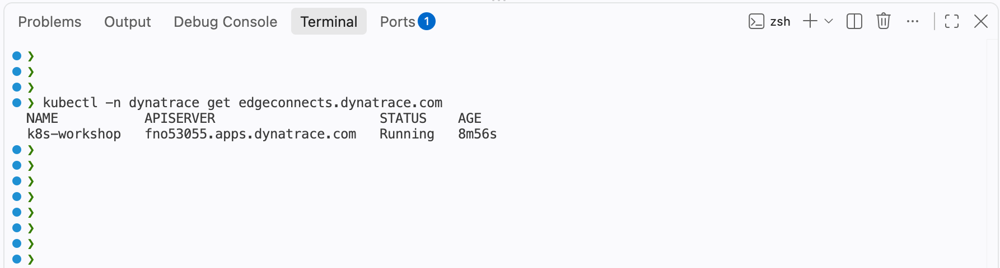
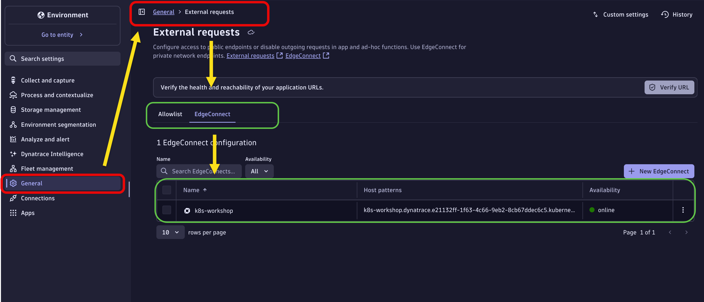
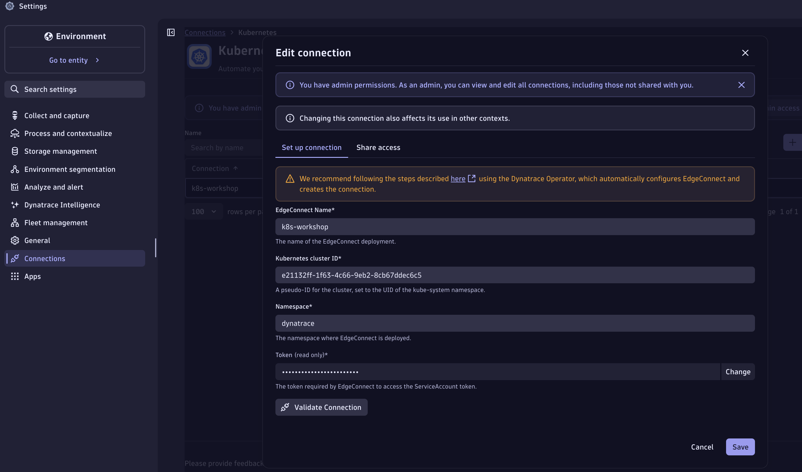
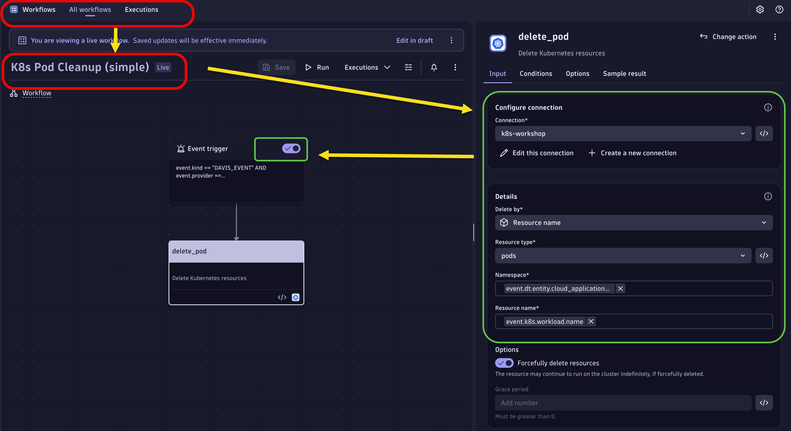
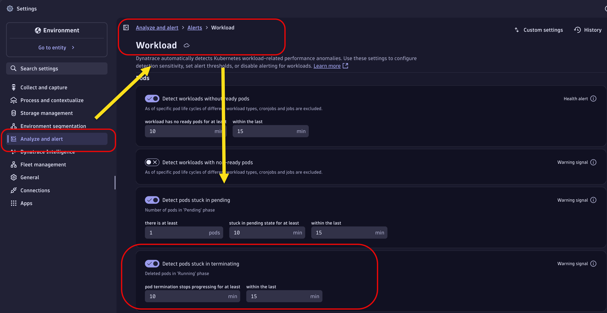
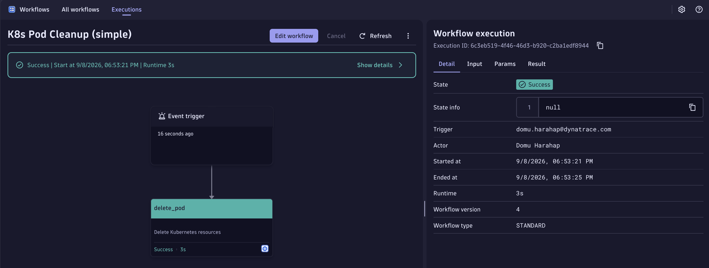
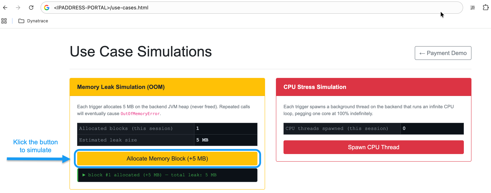

# EdgeConnect Automation Workshop

This hands-on workshop demonstrates how to use **Dynatrace EdgeConnect** to enable secure Kubernetes automation — allowing Dynatrace Workflows to execute `kubectl` actions against your cluster without exposing it to the internet.

Source: [github.com/domuharahap/Dynatrace-EdgeConnect](https://github.com/domuharahap/Dynatrace-EdgeConnect)

---

## Overview

EdgeConnect acts as a secure reverse-tunnel between Dynatrace and your Kubernetes cluster. Once deployed, the Dynatrace Automation Engine can execute Kubernetes actions (restart deployments, delete stuck pods) via the K8s API — triggered by Davis AI events, with optional human-approval gates.

**Use cases covered in this workshop:**

| # | Use Case | Trigger | Remediation | Mode |
|---|---|---|---|---|
| 1 | Stuck Terminating Pod | Pod stuck in `Terminating` > 5 min | Force-delete the pod via K8s API | Zero-touch |
| 2 | OOM / Memory Exhausted | App hits memory limit and crashes | `kubectl rollout restart` the deployment | Approval-gated |

---

## Prerequisites

Before starting, ensure you have the following:

- A Dynatrace Platform environment (SaaS or Managed) with Dynatrace Operator installed on the cluster
- GitHub Codespaces access (or a local Dev Container)
- The following credentials ready as Codespace secrets:

| Secret | Description |
|---|---|
| `DT_ENVIRONMENT` | Your DT platform URL, e.g. `https://abc123.apps.dynatrace.com` |
| `DT_OPERATOR_TOKEN` | Operator token from DT UI (auto-created when adding a cluster) |
| `DT_INGEST_TOKEN` | Ingest token (logs, metrics, traces) |
| `DT_CLIENT_ID` | OAuth Client ID — created in **Account Management > OAuth Clients**. Format: `dt0s02.XXXX` |
| `DT_CLIENT_SECRET` | OAuth Client Secret paired with `DT_CLIENT_ID` |
| `DT_URN_ACCOUNT` | Account URN for OAuth resource scope. Format: `urn:dtaccount:xxxxxxxx-xxxx-xxxx-xxxx-xxxxxxxxxxxx` |

---

## Part 1 — Create the OAuth Client

The EdgeConnect CRD uses OAuth for provisioning. You need to create a dedicated OAuth client in Dynatrace before deploying.

1. Open your Dynatrace environment and navigate to **Account Management** (top-right user menu)
2. Go to **Identity & Access Management > OAuth Clients**
3. Click **Create client**
4. Give it a name, e.g. `edgeconnect-k8s-workshop`
5. Under **Scopes**, add the following:
   - `automation:workflows:run`
   - `automation:workflows:read`
   - `automation:workflows:write`
   - `edge:connect:provision`
   - `edge:connect:read`
6. Click **Create** and copy both the **Client ID** (`dt0s02.XXXX`) and **Client Secret**
7. Copy the **Account URN** from Account Management — it looks like `urn:dtaccount:xxxxxxxx-xxxx-xxxx-xxxx-xxxxxxxxxxxx`

> Save these values as Codespace secrets (`DT_CLIENT_ID`, `DT_CLIENT_SECRET`, `DT_URN_ACCOUNT`) before launching the Codespace.

---

## Part 2 — Launch the Codespace

1. Open this repository on GitHub and click **Code > Codespaces > Create codespace on main**
2. GitHub will prompt you to set secrets before launch — confirm that all six secrets are populated:
   - `DT_ENVIRONMENT`, `DT_OPERATOR_TOKEN`, `DT_INGEST_TOKEN`
   - `DT_CLIENT_ID`, `DT_CLIENT_SECRET`, `DT_URN_ACCOUNT`
3. Wait for the Codespace to finish initializing (the post-create script installs the cluster and Dynatrace Operator)
4. Open the **Terminal** panel in VS Code (`View → Open View → Terminal`)
5. Verify the cluster is running:
   ```bash
   kubectl get nodes
   kubectl get pods -n dynatrace
   ```

---

## Part 3 — Deploy EdgeConnect (RBAC + CRD)

The `deployEdgeConnect` function reads your credentials directly from the environment variables set as Codespace secrets (`DT_CLIENT_ID`, `DT_CLIENT_SECRET`, `DT_ENVIRONMENT`, `DT_URN_ACCOUNT`), substitutes them into the manifest in memory, and applies everything in one step — no manual file editing required.

### Step 3.1 — Deploy EdgeConnect

```bash
deployEdgeConnect
```

This function:
1. Validates that all four required environment variables are set
2. Strips any `https://` prefix from `DT_ENVIRONMENT` (the `apiServer` field requires hostname only)
3. Substitutes credentials into the manifest in-memory via `sed` — nothing is written to disk
4. Applies the manifest via `kubectl apply`, creating:
   - `ServiceAccount` (`edgeconnect-sa`) in the `dynatrace` namespace
   - `Role` (`edgeconnect-role`) with least-privilege pod/deployment/configmap/job/PVC access
   - `RoleBinding` (`edgeconnect-rb`) binding the role to the service account
   - `Secret` containing your OAuth credentials
   - `EdgeConnect` CRD resource enabling `kubernetesAutomation`
5. Prints the EdgeConnect resource and pod status immediately after apply

### Step 3.2 — Verify EdgeConnect is running

```bash
kubectl get edgeconnect -n dynatrace
kubectl get pods -n dynatrace | grep edgeconnect
```

The EdgeConnect pod should reach `Running` state within ~60 seconds. It will register itself in the Dynatrace UI automatically.




### Step 3.3 — Confirm registration in Dynatrace

1. Open your Dynatrace environment
2. Navigate to **Infrastructure > Kubernetes > EdgeConnect**
3. You should see `k8s-workshop` listed with status **Online**



4. Navigate to **Infrastructure > Kubernetes > k8s-workshop**
5. Validate connection `k8s-workshop` listed with status **Connected**



---

## Part 4 — Deploy the Simulation Workloads

These workloads intentionally trigger the failure scenarios that the automation workflows will remediate.

### Step 4.1 — Stuck pod simulation

```bash
cd .devcontainer/apps
kubectl create ns dtusecase
kubectl -n dtusecase apply -f podtermination/podtermination-usecase.yaml
```

This creates a `busybox` pod named `stuck-pod` with a `preStop` hook that sleeps 300 seconds, simulating a pod stuck in `Terminating` state.

### Step 4.2 — dtpay application OOM usecase

```bash
deployDtpay
```

This deploys `dtpay applications` in the dtpay namespace. The container is configured with:
- Memory limit: `512Mi`
- JVM flag: `-XX:+ExitOnOutOfMemoryError`
- A load endpoint that allocates memory until the pod crashes


### Step 4.3 — Verify workloads are running

```bash
kubectl get all -n dtusecase
kubectl -n dtusecase get pod stuck-pod
```

---

## Part 5 — Import the Automation Workflows

### Step 5.1 — Import workflow files

In the Dynatrace UI:

1. Navigate to **Automations > Workflows**
2. Click **Import workflow** (top-right)
3. Import `use-case-automation-oom-remediation-w-k8s.workflow.json`
4. Import `use-case-automation-k8s-pod-cleanup.workflow.json`

These JSON files are available in the [reference repository](https://github.com/domuharahap/Dynatrace-EdgeConnect).

### Step 5.2 — Configure the pod cleanup workflow

Open `[use-case automation] - K8s Pod Cleanup`:

1. Click the **`delete_pod`** task → confirm the EdgeConnect instance is set to `k8s-workshop`
2. Save and **Activate** the workflow



### Step 5.3 — Configure the OOM workflow

Open `[use case automation] oom remediation w k8s`:

1. Click the **`send_notification`** task → update the Slack connection and channel to your own
2. Click the **`request_approval`** task → update the approver email/user ID
3. Click the **`restart_deployment`** task → confirm the EdgeConnect instance is set to `k8s-workshop`
4. Save and **Activate** the workflow


---

## Part 6 — Use Case 1: Stuck Pod Cleanup (Zero-Touch)

### Trigger the stuck pod scenario

For demo purposes simulation, change the k8s anomaly detection to triggered the active workflow:




Delete the pod — it will enter `Terminating` state and hang for 5 minutes due to the `preStop` hook:

```bash
kubectl delete pod stuck-pod -n dtusecase
kubectl -n dtusecase get pod stuck-pod -w
```

### Watch the zero-touch workflow execute

1. Davis AI detects `Pods stuck in terminating`
2. The workflow fires automatically — no approval required
3. The `delete_pod` task force-deletes the stuck pod via the EdgeConnect K8s connector

Validate in Dynatrace:
- **Automations > Workflows** — check the `K8s Pod Cleanup` execution history
- The pod should be gone:
  ```bash
  kubectl -n dtusecase get pod stuck-pod 
  ```



---

## Part 7 — Use Case 2: dtpay OOM Remediation (Approval-Gated)

### Trigger the OOM

1. Get the LoadBalancer URL for the demo app:```View - Port```
2. Open the URL in a browser to trigger the OOM scenario:
   ```bash
   https://<EXTERNAL-IP>/usecase.html
   ```

   

3. Watch the pod crash:
   ```bash
   kubectl -n dtpay get pods -w
   ```

### Watch the workflow execute

1. Davis AI detects the `Memory resources exhausted` event
2. The workflow fires:
   - **Slack notification** is sent to your channel
   - **Approval email** is sent to the configured approver
3. Open the approval link in the email
4. Click **Approve**
5. The workflow executes `kubectl rollout restart deployment/dtdemo-usecase -n dtpay`
6. A follow-up **Slack confirmation** message is sent

Validate in Dynatrace:
- **Automations > Workflows** — check execution history and task states
- **Infrastructure > Kubernetes** — verify the deployment restarted

---

## Cleanup

To remove the simulation workloads:

```bash
kubectl -n dtpay delete -f dtpay/manifest/dtpay.yaml
kubectl -n dtusecase delete pod stuck-pod --force --grace-period=0 2>/dev/null || true
```

To remove EdgeConnect:

```bash
kubectl -n dynatace delete -f edgeconnect/edgeconnect.yaml
```

---

## Reference

| Resource | Description |
|---|---|
| [Dynatrace-EdgeConnect](https://github.com/domuharahap/Dynatrace-EdgeConnect) | Source YAML manifests and workflow JSON files |
| [EdgeConnect documentation](https://docs.dynatrace.com/docs/setup-and-configuration/dynatrace-oneagent/oneagent-updatesbest-practices/connectivity/edgeconnect) | Official EdgeConnect setup guide |
| [Dynatrace Automation Workflows](https://docs.dynatrace.com/docs/platform-modules/automations/workflows) | Workflow authoring reference |
