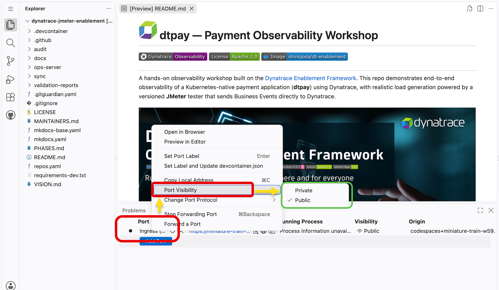
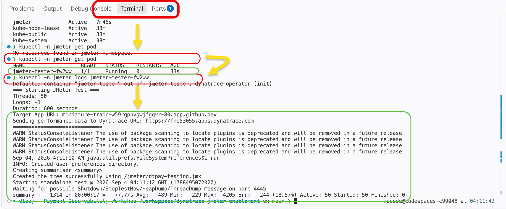
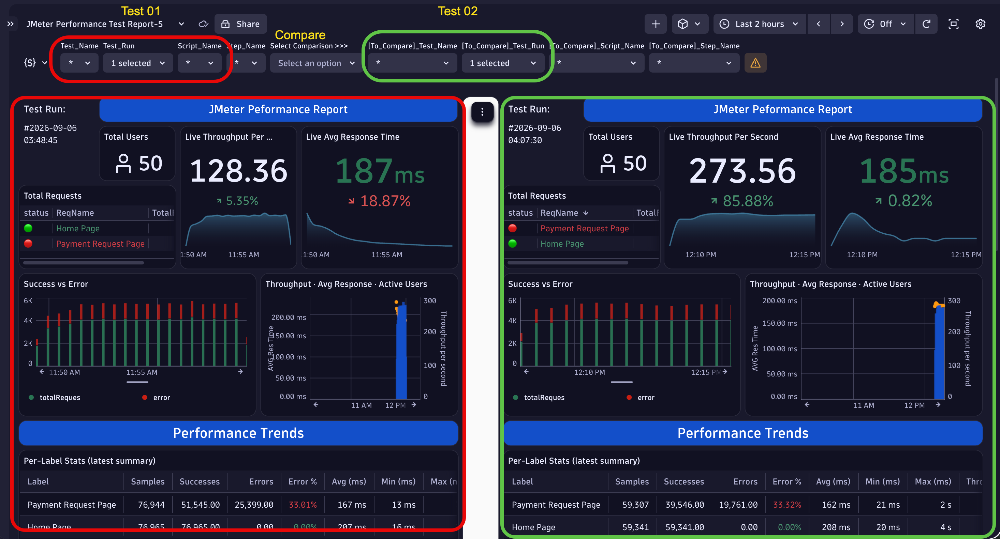

# JMeter Load Tester

The JMeter tester is a containerized Apache JMeter load generator designed to run performance tests against the dtpay payment application with built-in Dynatrace observability integration.

Source: [github.com/domuharahap/jmeter-tester](https://github.com/domuharahap/jmeter-tester)

---

## Overview

The tester runs as a one-shot Kubernetes `Job` in the `jmeter` namespace. The job auto-deletes 120 seconds after completion (`ttlSecondsAfterFinished: 120`). Each version adds deeper Dynatrace integration on top of the previous.

**Test scenarios (all versions):**

| Scenario | Request | Details |
|---|---|---|
| Home Page | `GET /` | Loads the React SPA |
| Payment | `POST /api/payment` | Randomized amount, method, name, and user ID |

---

## Versions

| Version | Image | What's new |
|---|---|---|
| `v1.0` | `domuharahap/jmeter-tester:v1.0` | Basic load test — results visible in DT APM traces |
| `v1.2` | `domuharahap/jmeter-tester:v1.2` | Adds `x-dynatrace-test` request header for test marking |
| `v1.3` | `domuharahap/jmeter-tester:v1.3` | BizEvents at test start and end with full summary stats |
| `v2.0` | `domuharahap/jmeter-tester:v2.0` | v1.3 + live stats BizEvent every 30 s & extended scenarios |

---

## Getting Started

Each version demonstrates a different Dynatrace observability use case. Follow the steps in order — each version builds on the previous.

### Prerequisites — GitHub Codespaces Port Visibility

JMeter runs as a pod **inside the cluster**, so it can reach dtpay via the cluster-internal service or ingress without going through the Codespaces forwarded URL. However, if you want to test from **local Postman or an external client** pointing at the forwarded URL, the port must be set to **Public** first — otherwise GitHub Codespaces blocks the request with a 401 or auth interstitial.

**Make port 80 public (VS Code Ports panel):**

1. Open the **Ports** panel in VS Code (`View → Open View → Ports`)
2. Find port **80** — labeled `Ingress (Applications)`
3. Right-click → **Port Visibility → Public**
4. Click the URL provided to make sure the dtpayment portal is accessible
5. Copy the URL for the next steps — it looks like `https://<codespace-name>-80.app.github.dev`

    

> Revert to **Private** when the workshop session ends to avoid exposing the ingress publicly.

---

### Start v1.1 — Basic APM Traces

**JMeter Use case 1:** Establish a baseline load against dtpay with no instrumentation beyond standard Dynatrace OneAgent APM. JMeter drives `GET /` and `POST /api/payment` traffic. In Dynatrace, the backend Spring Boot service appears in the distributed traces with response time and throughput data visible without any custom configuration.

1. Open the **Terminal** panel in VS Code (`View → Open View → Terminal`)
2. Type or copy and paste and run the command below to deploy JMeter and perform testing to the payment portal frontend
   ```bash
   runJmeterTest v1.0 paste-your-codespaces-url-generated-id-here-80.app.github.dev  # v1.0 | v1.2 | v1.3 | v2.0
   ```
3. Check the JMeter pod application status
   ```bash
   kubectl -n jmeter get all
   ```
4. Check the JMeter logs to validate the JMeter status running
   ```bash
   kubectl logs -n jmeter -l app=jmeter-tester --follow
   ```
   

5. Understand what is configured in JMeter:
   JMeter configures 2 URLs to test and will run for ~5 minutes of testing with 50 concurrent users hitting the domain.

   

6. Validate what you see in **Dynatrace Platform**: (`Services → Search and Select "Jmeter" Services → Navigate to Maps → Click Traces to see all transactions performed by JMeter`)

   
   Dynatrace Distributed Traces
   


7. Create a dashboard to see the stats result of the JMeter test of the application monitored by Dynatrace agents. (`Dashboards → Create New Dashboard`)

   i. Filter: `dt.smartscape.service.name = ":80" endpoint.name in (/, "/api/payment")`  
   ii. Summarize: `Count`, Split by: `http.response.status_code`

   


---

### Start v1.2 — Test Marking

**JMeter Use case 2:** Correlate load test traffic in Dynatrace using the `x-dynatrace-test` request header. Every JMeter request is tagged with the load test name, scenario, virtual user, and run ID. In Dynatrace, you can filter traces by test name and cleanly separate load-test traffic from real-user traffic.

The header attached to every request in this version:
```
x-dynatrace-test: LTN=<test-name>;LSN=<scenario>;TSN=<sampler>;VU=<thread>;RUN=<time>;RID=<run-id>
```

1. Configure Dynatrace to capture the test header as a **Request Attribute** so you can filter traces by it:
   - Navigate to `Settings → Server-side service monitoring → or search for 'Service Request attributes'`
   - Click **Add new request attribute**, name it `Load.Test.Name`
   - Set **New Data source** to `HTTP request header`, header name: `x-dynatrace-test`
   - Add a **Pre-processing step** — 1. Preprocess parameter by extracting substring: `Between` `LTN=` and `;`
   - Click **Save** and wait ~1 minute for Dynatrace to apply

    
   
   - Do complete for Request Attributes `Load.Script.Name` with processes param `Between` `LSN=` and `;`
   - Do complete for Request Attributes `Test.Step.Name` with processes param `Between` `TSN=` and `;`

2. Stop any currently running JMeter test before starting a new one
   ```bash
   stopJmeterTest
   ```

3. Open the **Terminal** panel in VS Code (`View → Open View → Terminal`)
4. Run the v1.2 test with test-marking headers enabled
   ```bash
   runJmeterTest v1.2 paste-your-codespaces-url-generated-id-here-80.app.github.dev
   ```
5. Check the JMeter pod application status to confirm the job started
   ```bash
   kubectl -n jmeter get all
   ```
6. Check the JMeter logs to confirm the test is running
   ```bash
   kubectl logs -n jmeter -l app=jmeter-tester --follow
   ```
   

7. Understand what is new in v1.2:
   JMeter now adds the standard `x-dynatrace-test` header to **every** request. The header encodes test metadata — test name (`LTN`), scenario name (`LSN`), sampler name (`TSN`), virtual user number (`VU`), run timestamp (`RUN`), and a unique run ID (`RID`). Dynatrace captures this header in each distributed trace automatically, so load-test traffic can be filtered and isolated from real-user traffic at any time.

8. Validate in **Dynatrace Platform** — filter traces by the load test:
   - Navigate to `Applications & Microservices → Distributed Traces`
   - Click **Add filter** → `Request attribute: LoadTestName` → enter `dTPay-Test-Case`
   - You should now see only JMeter-generated traces, fully isolated from any real user traffic
      

9. Create a dashboard to compare load-test traffic vs. real-user traffic side by side. (`Dashboards → Create New Dashboard/Upload `)

   i. Download or copy this Dashboard to your local machines. 
   [JMeter Perf Test Report-v1.2](dashboard/Jmeter-Performance-Test-Report-v1.2.json)
   
   ii. Navigate to `Dashboards → Select icon arrow on Top Right Conner → Upload`    
   iii. Now Lets Understand how the Metrics performance data pull out and present in dashboards.

   

---

### Start v1.3 — BizEvents: Start & End

**JMeter Use case 3:** Publish Dynatrace Business Events at the start and end of every test run. The `com.jmeter.test.summary` event captures avg/min/max latency, error rate, and throughput — queryable in DQL. Use this to compare performance across releases or configuration changes without needing a separate reporting tool.

| Event | When | Key Fields |
|---|---|---|
| `com.jmeter.test.start` | Before test (setUp group) | test name, target URL, thread count, duration |
| `com.jmeter.test.summary` | After test (tearDown group) | avg/min/max latency, error %, throughput, total requests |

1. Stop any currently running JMeter test before starting a new one
   ```bash
   stopJmeterTest
   ```

2. Open the **Terminal** panel in VS Code (`View → Open View → Terminal`)
3. Run the v1.3 test with BizEvents enabled
   ```bash
   runJmeterTest v1.3 paste-your-codespaces-url-generated-id-here-80.app.github.dev
   ```
4. Check the JMeter pod application status to confirm the job started
   ```bash
   kubectl -n jmeter get all
   ```
5. Check the JMeter logs — look for the BizEvent sent at test start, then watch for the summary event when the test finishes
   ```bash
   kubectl logs -n jmeter -l app=jmeter-tester --follow
   ```
   You should see log lines confirming `com.jmeter.test.start` was published at the beginning and `com.jmeter.test.summary` at the end.

   

6. Understand what is new in v1.3:
   Two Groovy scripts are added to the JMeter plan — one in the **setUp Thread Group** (executes before any load begins) and one in the **tearDown Thread Group** (executes after all threads finish). Each script builds a JSON payload and POSTs it to the Dynatrace Business Events ingest API (`/api/v2/bizevents/ingest`) using the `DT_URL` and `DT_TOKEN` credentials injected from the `dynatrace-creds` Kubernetes secret. The summary event includes computed statistics gathered across all samplers.

7. Validate the BizEvents in **Dynatrace Notebooks** using DQL:
   - Navigate to `Notebooks → New Notebook → Add DQL section`
   - Run the following query to see the test start and summary events:
     ```dql
     fetch bizevents
     | filter event.type == "com.jmeter.test.start" or event.type == "com.jmeter.test.summary"
     | sort timestamp desc
     | limit 20
     ```
   - You should see one `start` event and one `summary` event per completed test run
   - Lets download [JMeter Perf Test Report-v1.3](dashboard/Jmeter-Performance-Test-Report-v1.3.json) and upload the `start` and `summary` events into dashboard
   
   

---

### Start v2.0 — Live Stats & Extended Scenarios

**JMeter Use case 4:** Stream incremental BizEvents throughout the test run — not just at the end. A background thread group publishes rolling stats every 30 seconds, enabling a real-time Dynatrace dashboard that updates during the test. This version also adds an extended set of test scenarios covering more dtpay endpoints to produce a richer distributed trace topology. Useful for live demos and spotting regressions mid-run without waiting for test completion.

| Event | When | Key Fields |
|---|---|---|
| `com.jmeter.test.start` | Before test (setUp group) | test name, target URL, thread count, duration |
| `com.jmeter.test.stats` | Every 30 s during test | rolling avg/min/max latency, error count, throughput |
| `com.jmeter.test.summary` | After test (tearDown group) | final avg/min/max latency, error %, throughput, total requests |

1. Stop any currently running JMeter test before starting a new one
   ```bash
   stopJmeterTest
   ```

2. Open the **Terminal** panel in VS Code (`View → Open View → Terminal`)
3. Run the v2.0 test with live stats and extended scenarios
   ```bash
   runJmeterTest v2.0 paste-your-codespaces-url-generated-id-here-80.app.github.dev
   ```
4. Check the JMeter pod application status to confirm the job started
   ```bash
   kubectl -n jmeter get all
   ```
5. Check the JMeter logs — you will see a BizEvent emitted every 30 seconds during the test run
   ```bash
   kubectl logs -n jmeter -l app=jmeter-tester --follow
   ```
   Watch for repeating log lines like `[stats] BizEvent sent — T+30s`, `[stats] BizEvent sent — T+60s` to confirm live stats are publishing.

   

6. Understand what is new in v2.0:
   A third thread group — the **Stats Reporter** — runs in parallel with the main load threads. It wakes up every 30 seconds, collects rolling statistics from all active samplers, and POSTs a `com.jmeter.test.stats` BizEvent to Dynatrace. The interval is configurable via `STATS_INTERVAL_SEC` (default: `30`). The extended test plan also adds additional request scenarios (balance check, transaction history) to cover a broader set of dtpay endpoints, producing a richer service-map topology in Dynatrace.

7. Validate the live stats BizEvents in **Dynatrace Notebooks** using DQL — query this while the test is still running:
   - Navigate to `Notebooks → New Notebook → Add DQL section`
   - Run the following query:
     ```dql
     fetch bizevents
     | filter event.type == "com.jmeter.test.stats.live"
     | sort timestamp desc
     | limit 20
     ```
   - Click **Run** every 30 seconds — you should see new rows appearing in real time as the test progresses

8. Understand what is visible in Dynatrace during the live test:
   JMeter configure multiple URL scenarios to test covering all the dtpay endpoints, and will run for ~10 minutes with 50 concurrent users hitting the domain. Navigate to `Services → dtpay services → Service flow` to see the expanded service graph compared to v1.x.

9. Build a **real-time Dynatrace Dashboard** that auto-refreshes as the test runs. (`Dashboards → Create New Dashboard/Upload`)

   i. Download dashboard [JMeter Perf Test Report-v2.0](dashboard/JMeter-Performance-Test-Report-v2.0.json)

   ii. Upload a **New dashboard** set auto refresh the dashboard every 1-minutes intervals  

   

10. Run multiple test iterations and compare results using DQL — useful for tracking performance across releases or config changes:

    i. Download dashboard [JMeter Perf Test Report-v2.1](dashboard/JMeter-Performance-Test-Report-v2.1.json)
    
    ii. Upload a **New dashboard** set auto refresh the dashboard every 1-minutes intervals  
     

---

## Reference

### Configuration

| Variable | Default | Description |
|---|---|---|
| `JVM_THREADS` | `50` | Concurrent virtual users |
| `JVM_LOOPS` | `-1` | Iterations per thread (`-1` = run for full duration) |
| `JVM_DURATION` | `600` | Test duration in seconds |
| `JVM_APP_URL` | `dtpay.127.0.0.1.sslip.io` | Target domain — bare hostname, no protocol or port. Auto-detected from ingress, or overridden via `runJmeterTest` second argument |
| `JVM_DT_URL` | *(required)* | Dynatrace environment URL |
| `JVM_DT_TOKEN` | *(required)* | DT API token with `bizevents.ingest` scope |
| `STATS_INTERVAL_SEC` | `30` | How often (in seconds) v2.0 publishes a live stats BizEvent |

`JVM_DT_URL` and `JVM_DT_TOKEN` are read from a Kubernetes Secret (`dynatrace-creds` in the `jmeter` namespace). The framework functions create this secret automatically from `DT_ENVIRONMENT` and `DT_OPERATOR_TOKEN`.

---

### Running via Framework Functions

The framework provides shell functions for the full lifecycle. Source the framework first if not already done:

```bash
source .devcontainer/util/source_framework.sh
```

#### Start a test

```bash
# v1.0 default — auto-detect target URL from ingress
runJmeterTest

# Specify version
runJmeterTest v1.2      # with DT test marking
runJmeterTest v1.3      # with BizEvents summary
runJmeterTest v2.0      # with live BizEvents + extended scenarios

# Override JVM_APP_URL — use the Codespaces forwarded URL
runJmeterTest v1.0 your-frontend-payment-portal-80.app.github.dev
```

**Signature:** `runJmeterTest [version] [app_url]`

| Argument | Default | Description |
|---|---|---|
| `version` | `v1.0` | Image version tag (`v1.0`, `v1.2`, `v1.3`, `v2.0`) |
| `app_url` | auto-detected | Bare hostname override for `JVM_APP_URL` |

`runJmeterTest` will:

1. Resolve `JVM_APP_URL` — use `app_url` argument if given, otherwise auto-detect via `getAppURL payment-frontend`
2. Create the `jmeter` namespace
3. Create/update the `dynatrace-creds` secret from `DT_ENVIRONMENT` and `DT_OPERATOR_TOKEN`
4. Delete any prior `jmeter-tester` job
5. Apply [.devcontainer/apps/jmeter-tester/manifests/jmeter-job.yaml](.devcontainer/apps/jmeter-tester/manifests/jmeter-job.yaml)
6. Patch the image version and `JVM_APP_URL` at runtime
7. Wait up to 2 minutes for the pod to reach **Running** state, then return (non-blocking)

#### Stop a test

```bash
stopJmeterTest    # deletes the job and jmeter namespace
```

#### Check logs

```bash
kubectl logs -n jmeter -l app=jmeter-tester --follow
```

---

### Kubernetes Manifest

The base Job manifest is at [.devcontainer/apps/jmeter-tester/manifests/jmeter-job.yaml](.devcontainer/apps/jmeter-tester/manifests/jmeter-job.yaml).

Key settings:

```yaml
spec:
  ttlSecondsAfterFinished: 120  # auto-cleanup after completion
  backoffLimit: 0               # no retries on failure
  template:
    spec:
      restartPolicy: Never
      containers:
        - name: jmeter-tester
          image: domuharahap/jmeter-tester:v1.0   # patched at runtime by runJmeterTest
          resources:
            requests:
              memory: "512Mi"
              cpu: "200m"
            limits:
              memory: "1Gi"
              cpu: "500m"
```

The `JVM_APP_URL` and image tag are overridden at runtime by `kubectl set env` and `kubectl set image` inside `runJmeterTest`.

---

### Dynatrace Setup

**Required token scope:** `bizevents.ingest` (needed for v1.3 and v2.0)

**DQL — compare test run summaries:**
```dql
fetch bizevents
| filter event.type == "com.jmeter.test.summary"
| sort timestamp desc
| fields timestamp, test.name, avg.latency.ms, error.rate.pct, throughput.rps
```

**DQL — watch live stats in real time (v2.0 only):**
```dql
fetch bizevents
| filter event.type == "com.jmeter.test.stats"
| sort timestamp desc
| limit 20
```

**DQL — full event history for a single run:**
```dql
fetch bizevents
| filter event.type in ("com.jmeter.test.start", "com.jmeter.test.stats", "com.jmeter.test.summary")
| sort timestamp asc
```

---

## Tech Stack

- Apache JMeter 5.6.3 — headless, non-GUI mode
- Java 17 (OpenJDK, Alpine-based image)
- Groovy scripts for random data generation and BizEvent publishing
- Kubernetes Job for one-shot execution
- Dynatrace Business Events API v2
