# JMeter Load Tester

The JMeter tester is a containerized Apache JMeter load generator designed to run performance tests against the dtpay payment application with built-in Dynatrace observability integration.

Source: [github.com/domuharahap/jmeter-tester](https://github.com/domuharahap/jmeter-tester)

---

## Overview

The tester runs as a one-shot Kubernetes `Job` in the `jmeter` namespace. The job auto-deletes 60 seconds after completion (`ttlSecondsAfterFinished: 60`). Each version adds deeper Dynatrace integration on top of the previous.

**Test scenarios (all versions):**

| Scenario | Request | Details |
|---|---|---|
| Home Page | `GET /` | Loads the React SPA |
| Payment | `POST /api/payment` | Randomized amount, method, name, and user ID |

---

## Versions

| Version | Image | What's new |
|---|---|---|
| `v1.0` | `domuharahap/jmeter-tester:v1.0` | Basic load test — results visible in DT APM traces |
| `v1.2` | `domuharahap/jmeter-tester:v1.2` | Adds `x-dynatrace-test` request header for test marking |
| `v1.3` | `domuharahap/jmeter-tester:v1.3` | BizEvents at test start and end with full summary stats |
| `v1.4` | `domuharahap/jmeter-tester:v1.4` | v1.3 + live stats BizEvent every 30 s |
| `v2.0` | `domuharahap/jmeter-tester:v2.0` | Extended scenarios |

### v1.2 — Dynatrace Test Marking

Adds the standard `x-dynatrace-test` header to every request:

```
x-dynatrace-test: LTN=<test-name>;LSN=<scenario>;TSN=<sampler>;VU=<thread>;RUN=<time>;RID=<run-id>
```

### v1.3 — BizEvents: Start & End

Sends two Dynatrace Business Events:

| Event | When | Payload |
|---|---|---|
| `com.jmeter.test.start` | Before test (setUp group) | Test metadata |
| `com.jmeter.test.summary` | After test (tearDown group) | avg/min/max latency, error %, throughput |

### v1.4 — BizEvents: Live Stats

Extends v1.3 with a background thread group that sends incremental stats every 30 s.  
Interval is configurable via `STATS_INTERVAL_SEC` (default: `30`).

---

## Configuration

| Variable | Default | Description |
|---|---|---|
| `JVM_THREADS` | `50` | Concurrent virtual users |
| `JVM_LOOPS` | `-1` | Iterations per thread (`-1` = run for full duration) |
| `JVM_DURATION` | `600` | Test duration in seconds |
| `JVM_APP_URL` | `dtpay.127.0.0.1.sslip.io` | Target domain — bare hostname, no protocol or port. Auto-detected from ingress, or overridden via `runJmeterTest` second argument |
| `JVM_DT_URL` | *(required)* | Dynatrace environment URL |
| `JVM_DT_TOKEN` | *(required)* | DT API token with `bizevents.ingest` scope |

`JVM_DT_URL` and `JVM_DT_TOKEN` are read from a Kubernetes Secret (`dynatrace-creds` in the `jmeter` namespace). The framework functions create this secret automatically from `DT_ENVIRONMENT` and `DT_OPERATOR_TOKEN`.

---

## Prerequisites — GitHub Codespaces Port Visibility

JMeter runs as a pod **inside the cluster**, so it can reach dtpay via the cluster-internal service or ingress without going through the Codespaces forwarded URL. However, if you want to test from **local Postman or an external client** pointing at the forwarded URL, the port must be set to **Public** first — otherwise GitHub Codespaces blocks the request with a 401 or auth interstitial.

### Make port 80 public (VS Code Ports panel)

1. Open the **Ports** panel in VS Code (`View → Open View → Ports`)
2. Find port **80** — labeled `Ingress (Applications)`
3. Right-click → **Port Visibility → Public**

The forwarded URL (e.g. `https://<codespace-name>-80.app.github.dev`) is now accessible without GitHub authentication.

> Revert to **Private** when the workshop session ends to avoid exposing the ingress publicly.

### Why JMeter itself is unaffected

The JMeter job runs inside k3s/k3d and targets the ingress or service directly (e.g. `payment-frontend.dtusecase.svc.cluster.local`). It never uses the Codespaces-forwarded URL, so port visibility does not affect it.

---

## Running via Framework Functions

The framework provides shell functions for the full lifecycle. Source the framework first if not already done:

```bash
source .devcontainer/util/source_framework.sh
```

### Start a test

```bash
# v1.0 default — auto-detect target URL from ingress
runJmeterTest

# Specify version
runJmeterTest v1.2      # with DT test marking
runJmeterTest v1.3      # with BizEvents summary
runJmeterTest v1.4      # with live BizEvents
runJmeterTest v2.0      # extended scenarios

# Override JVM_APP_URL — bypass Codespaces forwarded URL, use cluster-internal address
runJmeterTest v1.0 payment-frontend.dtusecase.svc.cluster.local
runJmeterTest v1.4 payment-frontend.127.0.0.1.sslip.io
```

**Signature:** `runJmeterTest [version] [app_url]`

| Argument | Default | Description |
|---|---|---|
| `version` | `v1.0` | Image version tag (`v1.0`, `v1.2`, `v1.3`, `v1.4`, `v2.0`) |
| `app_url` | auto-detected | Bare hostname override for `JVM_APP_URL`. Use the cluster-internal service name to bypass Codespaces port forwarding auth |

`runJmeterTest` will:

1. Resolve `JVM_APP_URL` — use `app_url` argument if given, otherwise auto-detect via `getAppURL payment-frontend`
2. Create the `jmeter` namespace
3. Create/update the `dynatrace-creds` secret from `DT_ENVIRONMENT` and `DT_OPERATOR_TOKEN`
4. Delete any prior `jmeter-tester` job
5. Apply [.devcontainer/apps/jmeter-tester/manifests/jmeter-job.yaml](.devcontainer/apps/jmeter-tester/manifests/jmeter-job.yaml)
6. Patch the image version and `JVM_APP_URL` at runtime
7. Wait up to 2 minutes for the pod to reach **Running** state, then return (non-blocking)

### Stop a test

```bash
stopJmeterTest    # deletes the job and jmeter namespace
```

### Check logs

```bash
kubectl logs -n jmeter -l app=jmeter-tester --follow
```

---

## Kubernetes Manifest

The base Job manifest is at [.devcontainer/apps/jmeter-tester/manifests/jmeter-job.yaml](.devcontainer/apps/jmeter-tester/manifests/jmeter-job.yaml).

Key settings:

```yaml
spec:
  ttlSecondsAfterFinished: 60   # auto-cleanup
  backoffLimit: 0               # no retries on failure
  template:
    spec:
      restartPolicy: Never
      containers:
        - name: jmeter-tester
          image: domuharahap/jmeter-tester:v1.0   # patched at runtime
          resources:
            requests:
              memory: "1Gi"
              cpu: "500m"
            limits:
              memory: "2Gi"
              cpu: "1000m"
```

The `JVM_APP_URL` and image tag are overridden at runtime by `kubectl set env` and `kubectl set image` inside `runJmeterTest`.

---

## Dynatrace Setup

**Required token scope:** `bizevents.ingest` (needed for v1.3+)

**DQL query to compare test runs:**

```dql
fetch bizevents
| filter event.type == "com.jmeter.test.summary"
| sort timestamp desc
```

---

## Use Cases & Screenshots

Each version demonstrates a different observability use case. Replace the placeholder images below with actual screenshots once captured.

---

### v1.0 — Basic APM Traces

**Use case:** Establish a baseline load against dtpay with no instrumentation beyond standard Dynatrace OneAgent APM. JMeter drives `GET /` and `POST /api/payment` traffic. In Dynatrace, the backend Spring Boot service appears in the distributed traces with response time and throughput data visible without any custom configuration.

#### JMeter
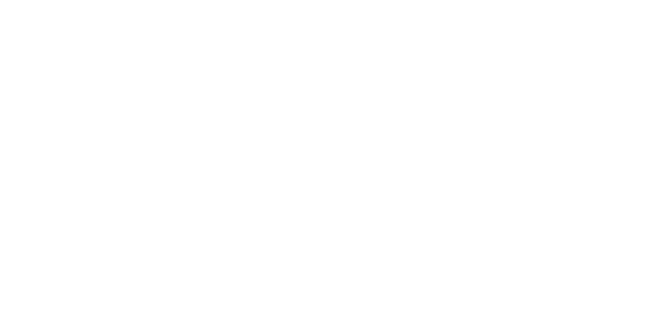

#### Dynatrace — Configuration
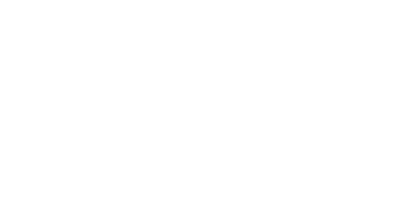

#### Dynatrace — Dashboard
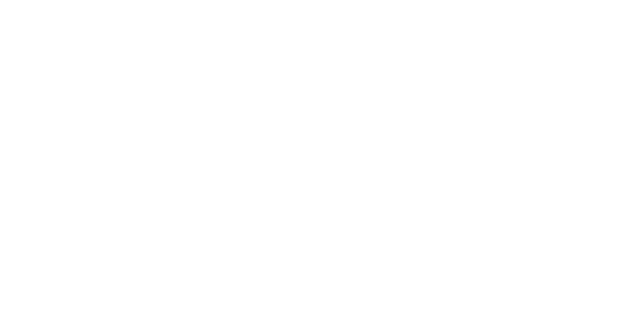

#### Dynatrace — Traces
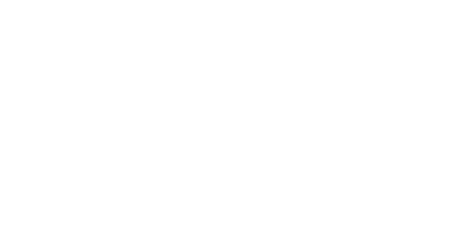

---

### v1.2 — Test Marking

**Use case:** Correlate load test traffic in Dynatrace using the `x-dynatrace-test` request header. Every JMeter request is tagged with the load test name, scenario, virtual user, and run ID. In Dynatrace, you can filter traces by test name and separate load-test traffic from real-user traffic.

#### JMeter
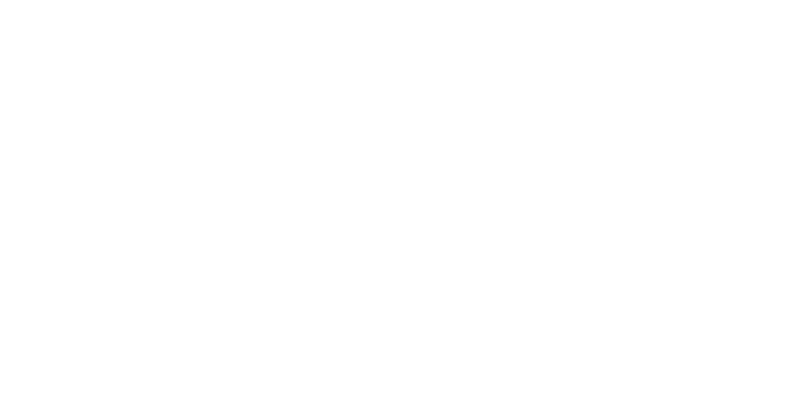

#### Dynatrace — Configuration
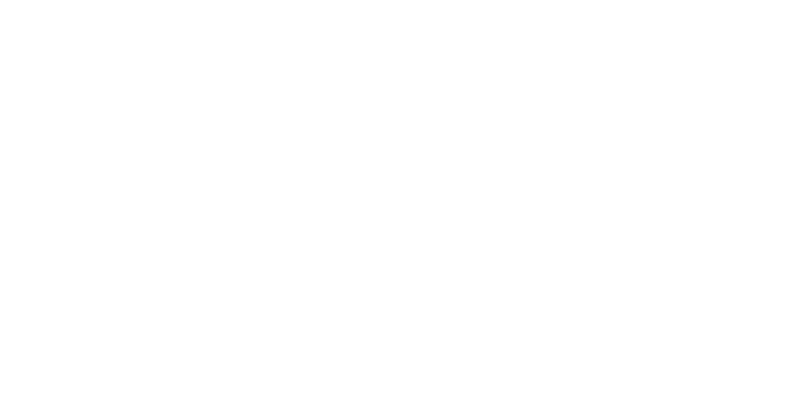

#### Dynatrace — Dashboard
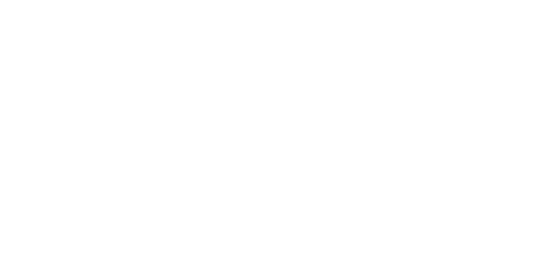

#### Dynatrace — Traces
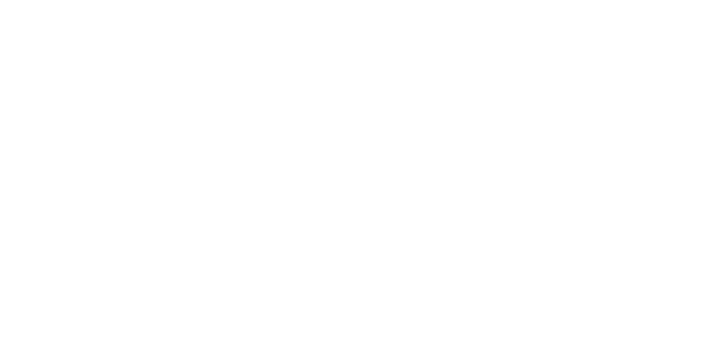

---

### v1.3 — BizEvents: Start & End Summary

**Use case:** Publish Dynatrace Business Events at the start and end of every test run. The `com.jmeter.test.summary` event captures avg/min/max latency, error rate, and throughput — queryable in DQL. Use this to compare performance across releases or configuration changes without needing a separate reporting tool.

#### JMeter
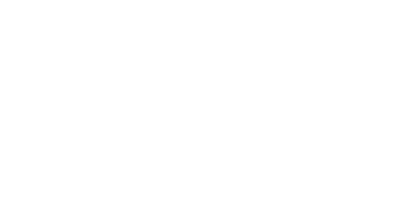

#### Dynatrace — Configuration


#### Dynatrace — Dashboard
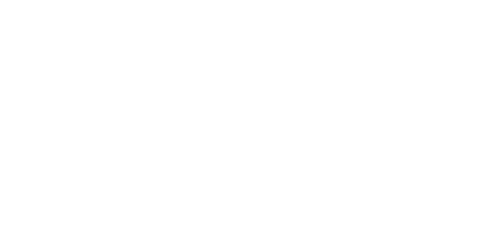

#### Dynatrace — Traces


---

### v1.4 — BizEvents: Live Stats Every 30s

**Use case:** Stream incremental BizEvents throughout the test run — not just at the end. A background thread group publishes rolling stats every 30 seconds, enabling a real-time Dynatrace dashboard that updates during the test. Useful for live demos and spotting regressions mid-run without waiting for test completion.

#### JMeter
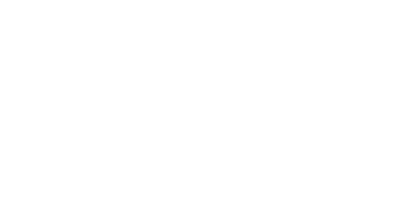

#### Dynatrace — Configuration


#### Dynatrace — Dashboard


#### Dynatrace — Traces


---

### v2.0 — Extended Scenarios

**Use case:** Extended test plan with additional request scenarios beyond `GET /` and `POST /api/payment`. Covers a broader set of dtpay endpoints to exercise more of the service graph in Dynatrace, producing richer distributed trace topology and more complete service-level metrics.

#### JMeter


#### Dynatrace — Configuration


#### Dynatrace — Dashboard
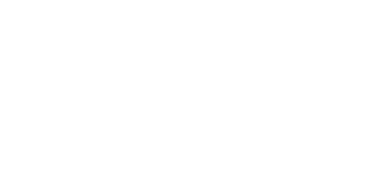

#### Dynatrace — Traces


---

## Tech Stack

- Apache JMeter 5.6.3 — headless, non-GUI mode
- Java 17 (OpenJDK, Alpine-based image)
- Groovy scripts for random data generation and BizEvent publishing
- Kubernetes Job for one-shot execution
- Dynatrace Business Events API v2
